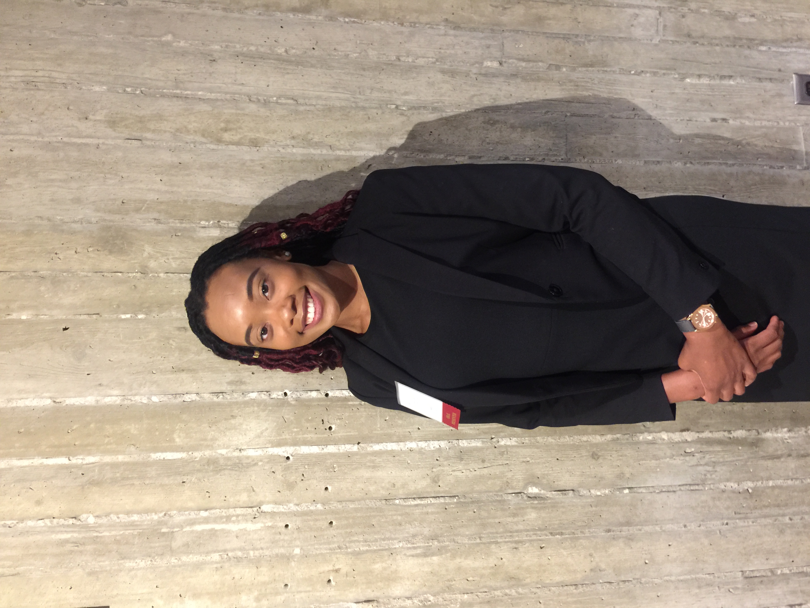

<!-- <link rel="stylesheet" href="styles.css" type="text/css"> -->

Hello,

My name is Brianna Lawton and I am a Civil Engineering, PhD student with a focus in Transportation Engineering and a minor in Community and Regional Planning at [Iowa State University](https://www.iastate.edu/) (ISU). I am originally from the Washington, D.C. Metropolitan area where I received my Bachelor’s of Science degree in Civil Engineering from [Morgan State University](https://www.morgan.edu/) (MSU), where I served as President and charter member of the first recorded historically black college and university (HBCU) chapter of [Chi Epsilon](http://www.chi-epsilon.org/xewebgeneral2/), the national Civil Engineering Honor Society. I am an inducted member of [Tau Beta Pi](https://www.tbp.org/home.cfm), the national Engineering Honor Society, where I served as outreach community service coordinator.

As an undergraduate, I gained experience working for industry companies and organizations like HDR Inc. and First Transit, which spurred from my being a COMTO CITY intern. I was also apart of our university's [ASCE](https://www.aisc.org/education/university-programs/student-steel-bridge-competition/) Steel Bridge team. While at MSU, I also conducted geotechnical-transportation research and presented at the annual [ASEE](https://www.asee.org/) Conference, which gave me the self-confidence and inspiration to continue my educational career to earn a PhD.  

Currently, I am working for the Iowa State University [Institute of Transportation](https://intrans.iastate.edu/) as a research assistant where I study methods of mitigating crash incidents along rural intersections by analyzing and implementing various safety countermeasures.

Being the engaged individual that I am, I am always eager to learn and assume more challenges that will help me grow in and outside the classroom by assuming positions like Vice President of ISU’s [Transportation Student Association](http://www.tsa.stuorg.iastate.edu/) (TSA), serving as the [Society of Women Engineers](https://isugradswe.weebly.com/) (SWE) graduate student liason, and taking the lead in my research group for projects.

## **Hobbies I Enjoy:**
### *Traveling abroad*
### *Writing poetry*
### *Working out*
### *Reading*
