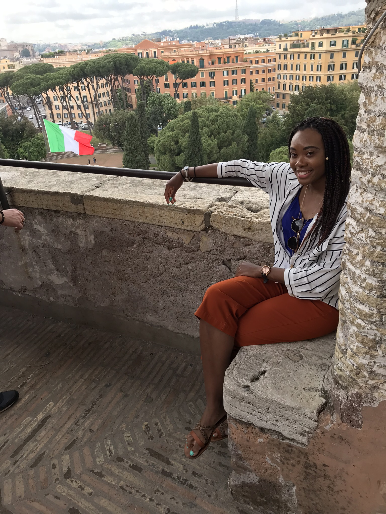
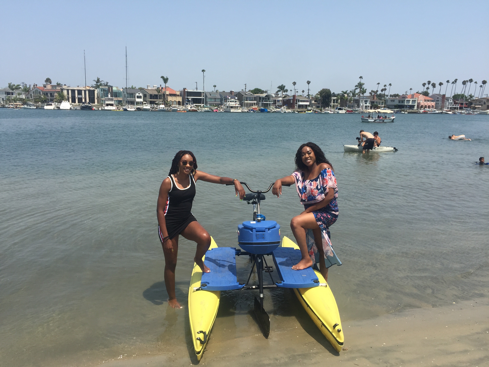
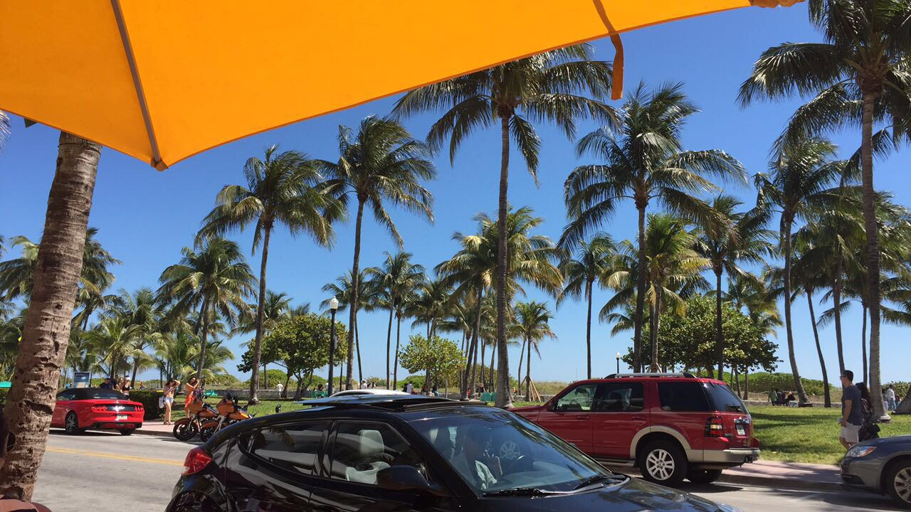

About 2 years ago, I made it a goal that I wanted to travel to at least one new country every year going forward. I beleive that the world's too big to only see on town, city, or state. You have to get outside your comfort zone, so I decided to do just that. The following are places I have traveled to both in and outside the United States (I'm American :)) but trust me there's lots more on my bucket list!

## **Rome, Italy**
I had the great opportunity to study abroad in Italy last summer 2017 to take a comparitive course focused on global perspectives in transportation. I got to visit the beautiful cities of Rome, Florence, Pisa, and Venice along with eat tasty food and tour histrical monuments like the Colosseum. 

## **Cancun, Mexico**
I had the fun pleasure of traveling to Mexico to see my family and spend time with them for vacation. While there, I got to see the first Catholic church in Mexico along with Chichen-Itza, one out of seven wonders of the world!

## **Las Angeles, California, USA**
I traveled to LA to catch up with one of my best friends and we tried water biking for the first time together!

<!--## **Las Vegas, Nevada, USA**
What happens in Vegas, Stays in Vegas! LOL ;) isn't that what they say...
Well being that I'm a Civil Engineer, I had to visit the Hoover Dam.

-->

## **Anse-la-Raye, St. Lucia**
St. Lucia was a hidden gem. Such a beautiful serene place to relax. I had the pleasure of traveling there for one of my friend's wedding. Congrats to them!

##**Ocho Rios, Jamaica**
Another family trip! But this time on a cruise...
The saying in Jamaica is "no worries, no problems" and thats how I was during that trip.

# Miami, Florida, USA
What do you do as an undergraduate student for Spring Break? That's right, you go to Miami! 
Well, not just for the fun and parties but I got to check out the Deco Art District because visiting art museums is one of my side hobbies. 

